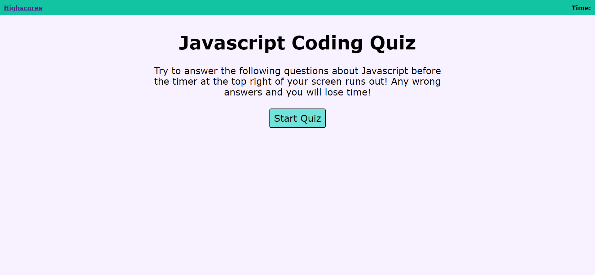
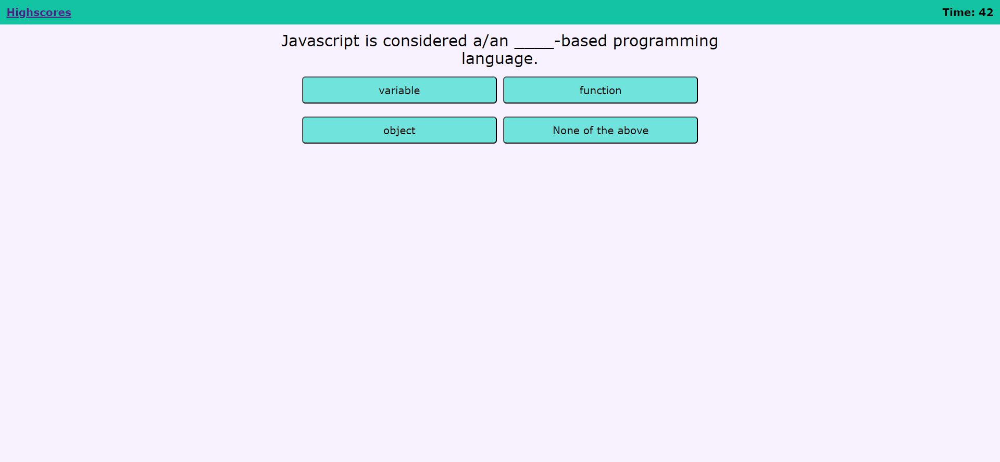
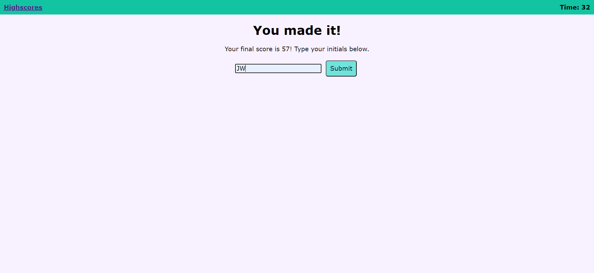
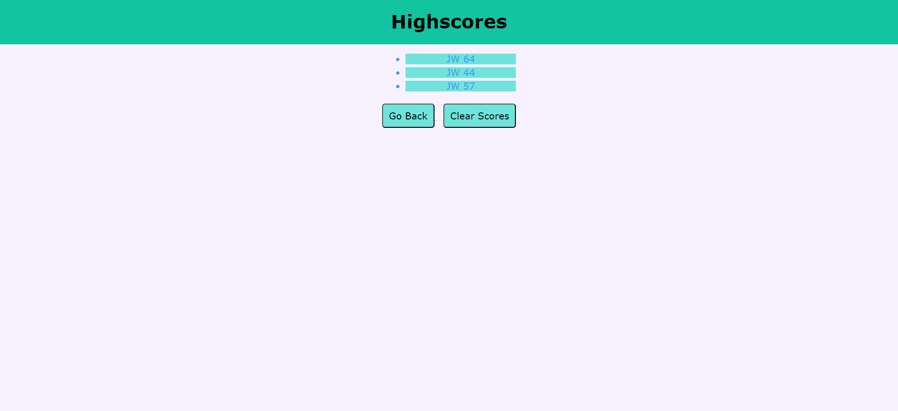

# Javascript-Quiz
This quiz was created from scratch for the fourth challenge.

## Reason for Quiz
This quiz was created as a study tool to help me remember the essentials to Javascript

## Code Sources

This quiz required two separate html files to create: one for the quiz itself which can be found under ```index.html``` and one for the highscores page found under ```highscores.html```
The javascript for the primary html page can be found under ```/assets/script/script.js```
The javascript for the highscores page can be found under ```/assets/script/highscores.js```
The stylesheet can be found under ```/assets/css/style.css```
The reset stylsheet can be found under ```/assets/css/reset.css```


## Link to Site

## Screenshots of Site








